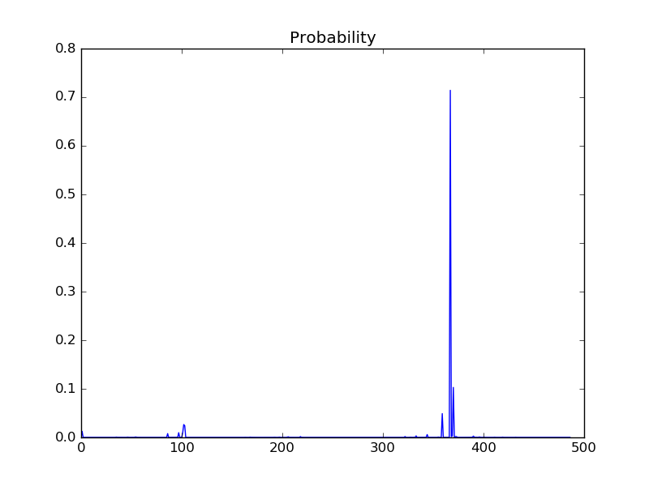

C3D Model for Keras + TensorFlow
================================

The scripts here are inspired by [`C3D Model for Keras`](https://gist.github.com/albertomontesg/d8b21a179c1e6cca0480ebdf292c34d2) gist, but specifically for Keras + TensorFlow (not Theano-backend).

To reproduce results:

- Run a script that does everything: `bash do_everything.sh`

Or, run each of these steps:

1. Download pretrained model: `bash models/get_weights_and_mean.sh`
2. Download sport1mil labels: `bash sports1m/get_labels.sh`
3. Download facebook/C3D `caffe.proto` file for conversion from caffe to Keras: `wget https://raw.githubusercontent.com/facebook/C3D/master/src/caffe/proto/caffe.proto`
4. Install protobuf per instruction in https://github.com/google/protobuf. In Ubuntu, `sudo apt-get install protobuf-compiler` will do.
5. Compile the caffe.proto file for python: `protoc --python_out=. caffe.proto`
6. Make sure the default keras config (in `~/.keras/keras.json`) has: `tf` image_dim_ordering, and `tensorflow` backend.
7. Convert the pre-trained model from Caffe format to Keras: `python convert_caffe_model.py`
8. Download test video: `bash download_test_video.sh`
9. Run test: `python test_model.py`

Results
=======
A following classification probability plot is expected. A peak at 367th class (probability = 71%) corresponds to basketball label.



If you close the plot, top 5 labels will be repoted, which should look something like:

```
Position of maximum probability: 367
Maximum probability: 0.71422
Corresponding label: basketball

Top 5 probabilities and labels:
basketball: 0.71422
streetball: 0.10293
volleyball: 0.04900
greco-roman wrestling: 0.02638
freestyle wrestling: 0.02408
```

References
==========

1. [C3D Model for Keras](https://gist.github.com/albertomontesg/d8b21a179c1e6cca0480ebdf292c34d2)
2. [Original C3D implementation in Caffe](https://github.com/facebook/C3D)
3. [C3D paper](https://arxiv.org/abs/1412.0767)
